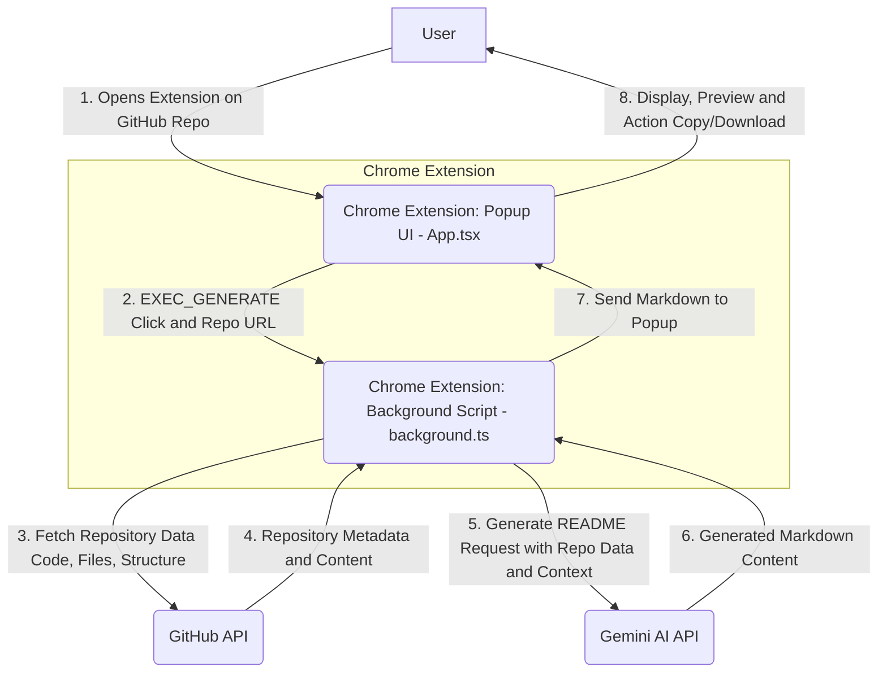

# `repopulse`

⚡️ Automate your GitHub READMEs with AI-powered precision and retro flair.

---

## Executive Summary

`repopulse` is an innovative Chrome Extension designed to revolutionize how developers create and maintain documentation for their GitHub repositories. Leveraging advanced AI capabilities (powered by Google Gemini) and the GitHub API, `repopulse` instantly generates comprehensive, high-quality `README.md` files tailored to your project's context. This extension significantly reduces the manual effort of writing initial documentation, ensures consistency across projects, and empowers developers to focus more on coding by providing immediate, intelligent README drafts. With its distinctive retro-futuristic user interface, `repopulse` offers an engaging and efficient experience, allowing users to preview, copy, or download their generated READMEs within seconds, making project onboarding and understanding a breeze for contributors and users alike.

## Architecture Overview

`repopulse` operates as a seamless integration within the Chrome browser, orchestrating interactions between the user, the GitHub platform, and powerful AI services. The architecture is designed for efficiency and responsiveness, ensuring a smooth experience from request to generated documentation.



**Explanation:** The user initiates the process by opening the `repopulse` extension while on a GitHub repository page. The `App.tsx` (Popup UI) detects the active repository URL and prompts the user to generate a README. Upon user command, the popup dispatches a message to the `background.ts` script. This background script, acting as the orchestrator, first communicates with the GitHub API to gather essential repository data, including file structure, code snippets, and project metadata. This rich context is then securely transmitted to the Gemini AI API, which processes the information to intelligently craft a relevant and detailed `README.md`. The generated markdown is returned to the background script, which then relays it back to the `App.tsx` popup for immediate display, offering both a rendered preview and raw markdown view, along with options to copy or download the file.

## Technical Stack

`repopulse` is built with a modern, robust, and developer-friendly stack, ensuring high performance, maintainability, and a delightful user experience.

### Core Technologies


### AI & API Integration


### Frontend & UI


### Build Tooling


### Development & Linting

 (Implicit, often used with ESLint)

## Getting Started

To get `repopulse` up and running on your local development environment, follow these steps. This guide will help you install dependencies, build the extension, and load it into your Chrome browser for testing and development.

### Prerequisites

Before you begin, ensure you have the following installed:

*   **Node.js**: `v18` or higher (recommended LTS version).
*   **npm** or **Yarn**: npm comes bundled with Node.js; Yarn can be installed separately.

### 1. Clone the Repository

First, clone the `repopulse` GitHub repository to your local machine:

```bash
git clone https://github.com/kmanu28/repopulse.git
cd repopulse
```

### 2. Install Dependencies

Navigate into the cloned directory and install the project dependencies using npm:

```bash
npm install
# Or if you prefer Yarn:
# yarn install
```

### 3. Configure API Keys

`repopulse` requires API keys for accessing the Google Gemini AI service and potentially the GitHub API (though GitHub API access is often unauthenticated for public repo data).

1.  **Google Gemini API Key**: Obtain a Gemini API key from the [Google AI Studio](https://ai.google.dev/).
2.  Create an `.env` file in the root of your project:
    ```
    VITE_GEMINI_API_KEY=YOUR_GEMINI_API_KEY
    ```
    *Note*: For Chrome Extensions, environment variables often need to be passed through the build process and configured within the extension's options page or background script directly, rather than relying solely on `.env` files for runtime API access. The `App.tsx` references `chrome.runtime.sendMessage` to `background.ts`, suggesting API key management might be handled via `options.html` and `chrome.storage`. Ensure your API key is securely handled and not exposed client-side. The `src/services/gemini.ts` file will likely read this configuration.

### 4. Build the Extension

To create a production-ready build of the extension, compile the TypeScript code and bundle the assets using Vite:

```bash
npm run build
# This will generate a 'dist' folder in your project root.
```

### 5. Load the Extension in Chrome

Now, you can load the built extension into your Chrome browser:

1.  Open Chrome and navigate to `chrome://extensions/`.
2.  Enable **Developer mode** by toggling the switch in the top-right corner.
3.  Click the **Load unpacked** button.
4.  Browse to your project directory and select the `dist` folder that was created in the previous step.
5.  The `repopulse` extension should now appear in your list of installed extensions. Pin it to your toolbar for easy access!

### 6. Run in Development Mode (Optional)

For active development, you can run a development server. While this primarily serves the `index.html` (the popup UI), changes to the background script or other extension-specific files will still require a re-build and re-loading the extension in Chrome to take effect.

```bash
npm run dev
```

This command will typically start a Vite development server. However, remember that the full Chrome Extension environment (including `chrome.tabs`, `chrome.runtime`, etc.) is only available when the extension is loaded unpackaged into Chrome, not when accessed directly via the `localhost` URL from the dev server.

### 7. Configure within the Extension

After loading the extension, click on its icon in your Chrome toolbar. You'll see a settings icon (<kbd>⚙️</kbd>). Click this to open the `options.html` page, where you can securely input and save your Gemini API key, ensuring the background script has access to it.
