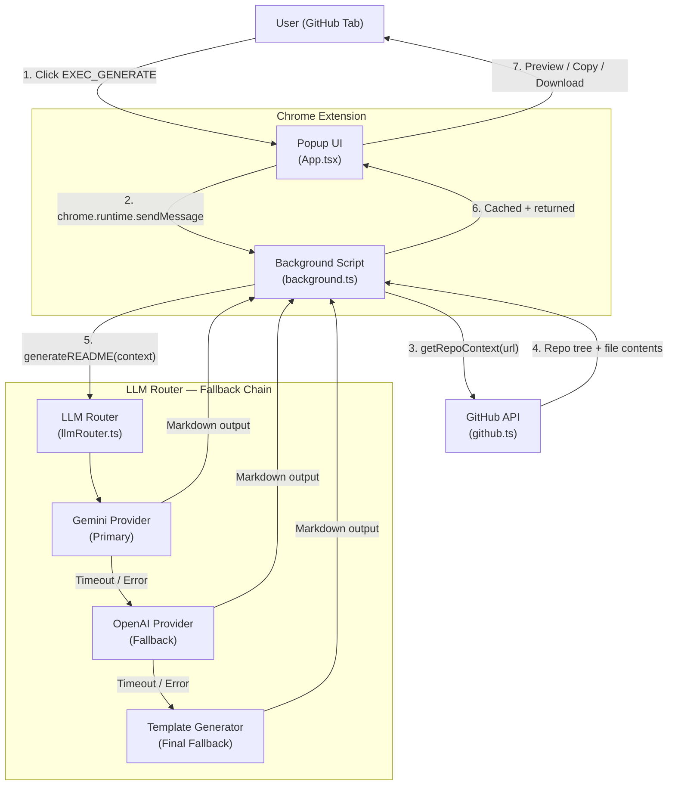

# `repopulse`

⚡️ Automate your GitHub READMEs with AI-powered precision — now with multi-provider failover and retro flair.

---

## Executive Summary

`repopulse` is a Chrome Extension that generates comprehensive, high-quality `README.md` files for any GitHub repository in seconds. It analyzes the repository's file tree, tech stack indicators, and primary entry points, then synthesizes that context into a well-structured, developer-focused README using AI. The extension now features a **provider-agnostic LLM routing layer** that tries Gemini first, falls back to OpenAI if Gemini is unavailable or unconfigured, and finally falls back to a smart template generator — guaranteeing output even when all AI providers fail. The retro-futuristic popup UI displays the result as a live rendered preview or raw markdown, ready to copy or download instantly.

---

## Architecture Overview

The extension is orchestrated through a layered architecture that separates GitHub data fetching, LLM routing, and UI rendering into clean modules.


```mermaid
flowchart TD
    A["User (GitHub Tab)"] -->|"1. Click EXEC_GENERATE"| B["Popup UI\n(App.tsx)"]
    B -->|"2. chrome.runtime.sendMessage"| C["Background Script\n(background.ts)"]
    C -->|"3. getRepoContext(url)"| D["GitHub API\n(github.ts)"]
    D -->|"4. Repo tree + file contents"| C
    C -->|"5. generateREADME(context)"| E["LLM Router\n(llmRouter.ts)"]

    subgraph router ["LLM Router — Fallback Chain"]
        E --> F["Gemini Provider\n(Primary)"]
        F -->|"Timeout / Error"| G["OpenAI Provider\n(Fallback)"]
        G -->|"Timeout / Error"| H["Template Generator\n(Final Fallback)"]
    end

    H -->|"Markdown output"| C
    G -->|"Markdown output"| C
    F -->|"Markdown output"| C
    C -->|"6. Cached + returned"| B
    B -->|"7. Preview / Copy / Download"| A

    subgraph ext ["Chrome Extension"]
        B
        C
    end
```

**How it works:** The popup detects the active GitHub repository URL and dispatches a message to the background script. The background script calls `getRepoContext()` to gather file tree and tech stack data via the GitHub API, then passes that structured context to `generateREADME()` — the single entry-point of the LLM routing layer. The router attempts each provider in order (Gemini → OpenAI → Template), isolating failures with `try/catch` blocks and a 12-second `Promise.race` timeout per provider. The result is cached in `chrome.storage.local` and sent back to the popup for rendering.

---

## Technical Stack

### Core


### AI & API Integration


### Frontend & UI


### Build Tooling


### Linting


---

## LLM Router

`src/services/llmRouter.ts` is the core of the AI generation system. All README generation flows through a single exported function:

```ts
generateREADME(context: RepoContext): Promise<string>
```

The router tries providers in this order, with a **12-second timeout** on each attempt:

| Priority | Provider | Trigger |
|----------|----------|---------|
| 1 | **Gemini** (`gemini-2.5-flash`) | `geminiApiKey` set in Options |
| 2 | **OpenAI** (`gpt-4o-mini`) | `openaiApiKey` set in Options |
| 3 | **Template fallback** | Always — no API key needed |

- Failures are isolated with `try/catch` — one provider's error never crashes the chain.
- All providers share the same prompt via `buildPrompt(context)` for consistent output.
- Adding a new provider requires only adding a new `async function` and one `try/catch` block in `generateREADME`.

---

## Getting Started

### Prerequisites

- **Node.js** v18 or higher
- **npm** (bundled with Node.js)
- A Chromium-based browser (Chrome, Edge, Brave, etc.)

### 1. Clone

```bash
git clone https://github.com/kmanu28/repopulse.git
cd repopulse
```

### 2. Install dependencies

```bash
npm install
```

### 3. Build the extension

```bash
npm run build
# Outputs to the /dist directory
```

### 4. Load into Chrome

1. Open `chrome://extensions/`
2. Enable **Developer mode** (top-right toggle)
3. Click **Load unpacked**
4. Select the `dist/` folder from your project root
5. Pin the extension to your toolbar

### 5. Configure API Keys

Click the **⚙️ settings icon** in the extension popup to open the Options page. Enter your keys:

| Field | Description |
|-------|-------------|
| **Gemini API Key** | Primary LLM provider. Get one at [aistudio.google.com](https://aistudio.google.com/apikey) |
| **OpenAI API Key** | Fallback provider. Get one at [platform.openai.com](https://platform.openai.com/api-keys) |
| **GitHub PAT** | Optional. Bypasses GitHub API rate limits for private or heavily-fetched repos |

Keys are stored locally via `chrome.storage.local` and never leave your browser.

> **Note:** Both API keys are optional individually — the router skips any provider whose key is missing and tries the next one. If neither key is set, the template fallback always produces a README.

### 6. Development mode

```bash
npm run dev
```

The Vite dev server serves the popup UI for browser testing. Full Chrome extension APIs (`chrome.tabs`, `chrome.runtime`, etc.) are only active when the extension is loaded unpacked via `chrome://extensions/`.

---

## Project Structure

```
repopulse/
├── src/
│   ├── App.tsx              # Popup UI — retro-themed, tabs for preview/raw
│   ├── background.ts        # Service worker — orchestrates fetch + generate
│   ├── options.tsx          # Settings page — API key management
│   ├── index.css            # Global retro design system
│   └── services/
│       ├── llmRouter.ts     # Provider-agnostic LLM router (Gemini → OpenAI → Template)
│       ├── gemini.ts        # Legacy Gemini helper (kept for reference)
│       └── github.ts        # GitHub API — repo tree, file content, context builder
├── public/                  # Static assets (icons, manifest)
├── dist/                    # Production build output (load this in Chrome)
├── vite.config.ts
└── package.json
```
